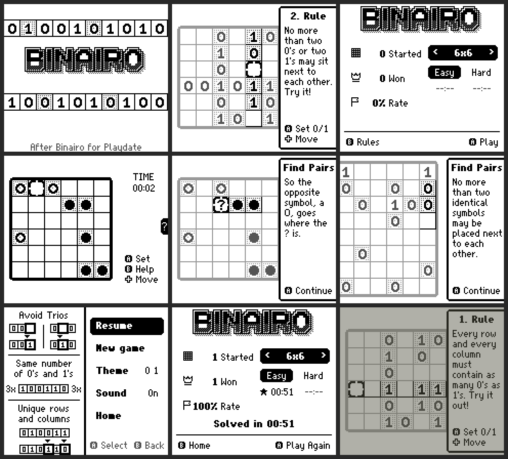

# Binairo for Game Boy

A Game Boy / Game Boy Color version of **Binairo**, the Playdate logic puzzle by Pocket Games
(https://pocketgames.itch.io/binairo), written in C for **GBDK-2020**.

> [!NOTE]
> This game was entirely created by Claude Opus 5.5 on High effort.

Fill the grid with 0s and 1s:

1. Every row and column holds as many 0s as 1s.
2. No more than two identical symbols next to each other.
3. All rows and all columns are unique.

## What's in it

- 480 generated puzzles: 6x6 and 8x8, Easy and Hard (120 each). Every puzzle has one solution
  and can be solved by logic alone.
- An interactive tutorial that teaches the three rules on a demo puzzle, following the Playdate one.
  It starts on first launch and you can replay it with B on the home screen.
- A hint system with step-by-step explanations: *Find Pairs*, *Avoid Trios*, *Same Sum*,
  *Look Ahead*, *Be Unique*, and a *Mistake* check that spots wrong symbols and removes them.
  The board dims except for the cells the hint is about, the hint panel slides in from the right
  and a `?` marks the target cell.
- Themes: 0/1, circles, squares and -/+ (START, then Theme).
- A timer, statistics per size and difficulty (started / won / rate), best times,
  and auto-save with resume. All of this is saved to battery RAM.
- A side menu, like the Playdate system menu, with a rules cheat-sheet.
- Sound effects and a win jingle. Sound can be turned off in the menu.
- Runs on DMG (4 shades) and in colour on CGB, using a Playdate-style silver/ink palette.

## Controls

| Button   | Action                                   |
|----------|------------------------------------------|
| D-pad    | Move the cursor                          |
| A        | Cycle cell: empty -> 0 -> 1 -> empty     |
| B        | Hint (the Playdate crank / B)            |
| SELECT   | Undo                                     |
| START    | Side menu (resume, new game, theme, sound, home) |

Home screen: Left/Right changes the size, Up/Down changes the difficulty, A plays or resumes,
B opens the tutorial, and SELECT goes to the title screen.

## Building

Requirements: GBDK-2020 (4.x) and Python 3. Pillow is optional; it's only used for the preview PNGs.

```sh
# (re)generate graphics and the puzzle bank - optional, generated files are included
make assets
# build the ROM
make GBDK=/path/to/gbdk        # produces binairo.gb
```

The ROM is 64 KB, MBC1 + RAM + battery, and CGB compatible. Tested in PyBoy (DMG and CGB modes).

## Layout

```
src/main.c      boot, display modes (tile mode + full-screen bitmap mode), input, palettes
src/gfx.c       software surfaces, fast proportional-font renderer (asm blitter), bank-safe copies
src/game.c      board, cursor, HUD, hint panel, tutorial, win sequence      (ROM bank 1)
src/menu.c      title, home/statistics and side menu screens                (ROM bank 1)
src/hint.c      hint engine (pairs, trios, counting, line enumeration, uniqueness, mistakes)
src/sound.c     sound effects and jingle
src/save.c      battery save
src/assets.c    generated tiles: cells, ring, sprites, logo, icons, rules card (ROM bank 2)
src/font.c      generated proportional font
src/puzzles.c   generated puzzle bank                                         (ROM bank 3)
tools/          font, asset and puzzle generators (Python)
test/           PyBoy test scripts used during development
```

Technical notes:

- The menus use a full-screen 160x144 bitmap. It needs 360 unique tiles, so the game flips LCDC
  bit 4 at scanline 72 to reach them.
- The game screen uses composable 2x2 cell tiles and the window layer for the sliding hint panel.
  On 8x8 boards the board scrolls to keep the hint's cells visible.

## Differences from the Playdate version

- The screen is 160x144 instead of 400x240, so layouts are condensed, and on 8x8 the hint panel
  covers part of the board (the board scrolls to compensate).
- There's no crank, so hints are on B. Undo on SELECT is new.
- Puzzles, graphics, font and texts are my own recreations in the original's style.
  No assets were taken from the Playdate game.


